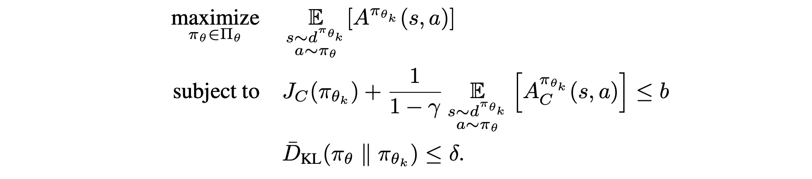
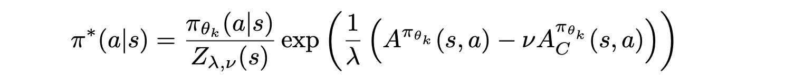
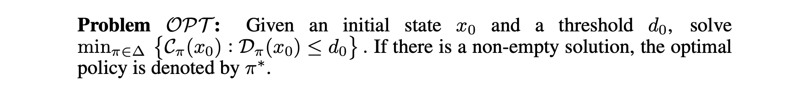
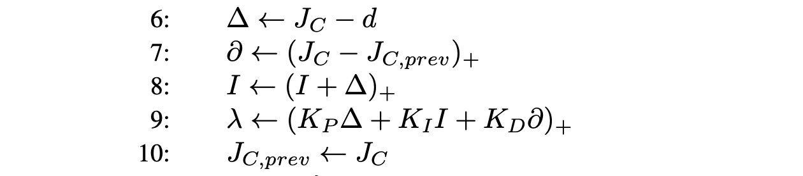

### Constrained Optimization in RL

[toc]

### Basic knowledge
#### Descent direction
1. $\text{Lemma 1:}$ Given $x \in \mathbb{R}^{n}$ and $f: \mathbb{R}^{n} \rightarrow \mathbb{R}$, among all directions from $x$, the direction $d=-\nabla f(x)$ gives the maximum rate of decrease in terms of the value of $f$.
2. $\text{Lemma 2:}$ Given $x \in \mathbb{R}^{n}$ and $f: \mathbb{R}^{n} \rightarrow \mathbb{R}$, any direction $d \in \mathbb{R}^{n}$ satisfying $\langle d, \nabla f(x)\rangle<0$ is a descent direction.
3. $\text{Lemma 3:}$ Given $x \in \mathbb{R}^{n}, f: \mathbb{R}^{n} \rightarrow \mathbb{R}, S \in \mathbb{S}_{++}^{n}$, the direction $-S \nabla f(x) \in \mathbb{R}^{n}$ is a descent direction at $x$.
4. Different local approximation:
    1. $f(x) \approx f\left(x_{k}\right)+\nabla f\left(x_{k}\right)^{\top}\left(x-x_{k}\right)+\frac{1}{2 \alpha_{k}}\left(x-x_{k}\right)^{\top} S^{-1}\left(x-x_{k}\right)$
    2. $x_{k+1}=x_{k}-\alpha_{k} \cdot S_{k} \nabla f\left(x_{k}\right)$, Where $ S_{k} \in \mathbb{S}_{++}^{n}$
        1. Gradient descent: $S_k = I_n$
        2. Newton direction: $S_k = [\nabla^2f(x_k)]^{-1}$
        3. Scaled Newton direction: $S_k = \text{diag}([\nabla^2f(x_k)]^{-1})$
        4. Quasi-Newton direction: approximation of $[\nabla^2f(x_k)]^{-1}$
        5. Regularized Newton direction: $S_{k}=\left[\nabla^{2} f\left(x_{k}\right)+\mu_{k} I\right]^{-1}$
   
##### Stepsize
1. $\text{Assumption 1:}$ L-Lipschitz continuos gradient: $\|\nabla f(x)-\nabla f(y)\|_{2} \leq L\|x-y\|_{2}$
2. $\text{Lemma 4:}$ if $f$ has L-Lipschitz continuos gradient and convex, then (s and n) $f(y) \leq f(x)+\nabla f(x)^{\top}(y-x)+\frac{L}{2}\|y-x\|_{2}^{2}$.
3. $\alpha= \frac{1}{L}$, then $f\left(x_{k}\right)-f^{\star} \leq \frac{\left\|x_{0}-x^{\star}\right\|_{2}^{2}}{2\alpha k}$

#### Project Subgradient
1. First-order condition for convex function: $f(y) \geq f(x)+\nabla f(x)^{\top}(y-x)$
2. Subgradient: $f(x) \geq f\left(x_{0}\right)+y^{\top}\left(x-x_{0}\right)$
   1. $y \in \mathbb{R}^{n}$ is called a subgradient
   2. The set $\partial f\left(x_{0}\right)$ of all subgradients is the subdifferential of $f$ at $x_0$
   3. Supporting hyperplane
      1. Definition 3 (Supporting hyperplane). Consider a nonempty set $C \subseteq \mathbb{R}^{n}$ and a boundary point $x_{0} \in b d(C) .$ If $a \neq 0$ in $\mathbb{R}^{n}$ satisfies $a^{\top} x \leq a^{\top} x_{0}, \forall x \in C$, then $\left\{x \mid a^{\top} x=a^{\top} x_{0}\right\}$ is called a supporting hyperplane to $C$ at $x_{0}$.
      2. Theorem 1 (Weak Separating Hyperplane Theorem). Consider any convex set $C \subseteq \mathbb{R}^{n}$ and $a$ point $x_{0} \in \mathbb{R}^{n} /\ C$. Then, there exist $a \neq 0$ (in $\mathbb{R}^{n}$ ) and $b \in \mathbb{R}$ with $a^{\top} x \leq b \; \text { and } \; a^{\top} x_{0} \geq b,  \forall x \in C$
      3. For convex function, $\partial f\left(x_{0}\right)\neq \emptyset$
3. Orthogonal Projection
   1. $P_{C}(x) \equiv \underset{y \in C}{\arg \min }\|y-x\|$
   2. The projection $y^*\in C$ is unique 
   3. non-expansive:
      1. $P_{C}(x)-P_{C}(y)\le \|x-y\|$
4. Projection gradient
   1. $x_{k+1} = P_{C}(x_k - \alpha_k \nabla f(x_k))$
   2. equal to optimize the local approximation: 
       1. $x_{k+1} = \argmin_{x\in C}\{ f(x_k) + \nabla_k f(x_k)^T(x-x_k)+\frac{L}{2}\|x-x_k\|^2 \}$
#### Proximal Algorithms
1. Proximal operator: $\left.\operatorname{prox}_{f}(x)=\arg \min _{u \boldsymbol{c} \in \mathbb{R}^{n}}\{f(u))+\frac{1}{2}\|u-x\|^{2}\right\}$
   1. Consider optimizing the composite function $f(x)+g(x)$
      1. Project gradient: 
$$\begin{aligned}
x_{k+1} &=\underset{x \in \mathbb{R}^{n}}{\arg \min }\left\{f\left(x_{k}\right)+\nabla f\left(x_{k}\right)^{\top}\left(x-x_{k}\right)+g(x)+\frac{1}{2 \alpha_{k}}\left\|x-x_{k}\right\|^{2}\right\} \\
&=\underset{x \in \mathbb{R}^{n}}{\arg \min }\left\{\alpha_{k} g(x)+\frac{1}{2}\left\|x-({x_{k}-\alpha_{k} \nabla f\left(x_{k}\right)})\right\|^{2}\right\}\\
&= \operatorname{prox}_{\alpha_{k} g}\left(x_{k}-\alpha_{k} \nabla f\left(x_{k}\right)\right)
\end{aligned}$$
        2. gradient descent for $f(x_k)$, then project to $f(x_k)+g(x)$
2. Proximal gradient descent
   1. $T_{L}^{f, g}\{x)=\operatorname{prox}_{\frac{1}{L} g}\left(x-\frac{1}{L} \nabla f(x)\right)$
3. The Augment Lagrangian Methods
   1. $H^{\star}=\min \left\{H(x, z) \equiv h_{1}(x)+h_{2}(z) \mid A x+B z=c\right\}$
   2. Lagrangian function:
$$\begin{aligned}
L(x, z, y) &=h_{1}(x)+h_{2}(z)+y^{\top}(A x+B z-c) \\
&={h_{1}(x)+y^{\top} A x}+h_{2}(z)+y^{\top} B z-y^{\top} c 
\end{aligned}$$
    3. dual function: $g(y)=\min_{x,z}\;\{h_{1}(x)+y^{\top} A x+h_{2}(z)+y^{\top} B z-y^{\top} c \}$
       1. minimize the $-g(y)$ using proximal methods:
          1. $y_{k+1} = \argmin_{y} \{ -g(y)+\frac{1}{2\rho} \|y-y_k \|^2 \}$
          2. stationary point: $y_{k+1} = y_k + \rho \nabla_y g(y_{k+1})$
             1. $y_{k+1} = y_k + \rho(A^Tx_{k+1}+B^Tz_{k+1}-c)$
             2. $x_{k+1} = \argmin_x h_1(x) + y^T_{k+1}Ax$
                1. stationary point: $0=A^T(y_k + \rho(A^Tx_{k+1}+B^Tz_{k+1}-c))+\partial_x h_1(x_{k+1})$
             3. $z_{k+1} = \argmin_z h_2(z) + y^T_{k+1}Bz$
                1. stationary point: $0=B^T(y_k + \rho(A^Tx_{k+1}+B^Tz_{k+1}-c))+\partial_z h_2(z_{k+1})$
          3. $x_{k+1},z_{k+1}$ equal to solve: 
             1. $H(x,z)=h_1(x)+h_2(z)+\frac{\rho}{2}\|Ax+Bz-c+\frac{1}{\rho}y_k\|^2$
    4. algorithms:
       1. $x_{k+1},z_{k+1}= \argmin_{x,z} H(x,z)$
       2. $y_{k+1} = y_{k} + \rho(A^Tx_{k+1}+B^Tz_{k+1}-c)$
    5. ADMM
       1. $x_{k+1}= \argmin_{x} H(x,z_k)$
       2. $z_{k+1}= \argmin_{z} H(x_{k+1},z)$
       3. $y_{k+1} = y_{k} + \rho(A^Tx_{k+1}+B^Tz_{k+1}-c)$

#### Extra-gradient
1. projection gradient descent:
   1. $x_{k+1}=P_C(x_k-\alpha_k\nabla_xf(x_k))$
   2. optimality condition: $x^*=P_C(x^*-\alpha_k\nabla_xf(x^*))$
2. Extrapolation
   1. $\bar{x}_k = x_k + \beta (x_k - x_{k-1})$
   2. $x_{k+1} = x_k - \alpha \nabla_x f(\bar{x}_k)$
3. Project extra-gradient:
   1. $\bar{x}_{k+1}=P_C(x_k-\alpha_k\nabla_xf({x}_k))$
   2. ${x}_{k+1}=P_C(x_k-\alpha_k\nabla_xf(\bar{x}_{k+1}))$

#### Natural Gradient
1. When optimizing distribution: $p(x|\theta)$
   1. distance between different distribution: $\text{KL}[p|q]=\int p(x)\log\frac{p(x)}{q(x)}$
   2. local approximation of KL divergence: 
      1. $KL[p(x|\theta)|p(x|\theta+\delta)]\approx \int p(x|\theta)[\log p(x|\theta)-(\log p(x|\theta) + \delta  \nabla \log p(x|\theta) + \frac{1}{2}\delta^2 \nabla^2 \log p(x|\theta))] $
      2. $KL \approx \frac{1}{2}\delta E_p[\nabla^2 \log p(x|\theta)] \delta$
      3. $H=E_p[\nabla^2 \log p(x|\theta)] = E_p[\nabla\log p(x|\theta)\nabla\log p(x|\theta)^T]$
   3. Descent direction in the trust region:
      1. $\min _{D_{K L}\left[p_{\theta} \| \theta+\delta \theta\right] \leq \epsilon} L(\theta+\delta \theta)$
      2. Lagrangian: $\min L(\theta+\delta \theta)+\lambda\left(D_{K L}\left[p\left(\theta \| p_{\theta+\delta \theta}\right)\right]-\epsilon\right)$
      3. Approximation: $L(\theta)+\nabla L(\theta)^{T} \delta \theta+\lambda\left(\frac{1}{2} \delta \theta^{T} H \delta \theta-\epsilon\right)$
      4. Direction: $\delta \theta^{*}=-\frac{1}{\lambda} H^{-1} \nabla_{\theta} L(\theta)$

#### Conjugate gradient
1. Gradient descent
   1. exact step size search
      1. residue: $r_k=b-Qx_k$
      2. stepsize: $\alpha_k=\frac{r_k^Tr_k}{r_k^TQr_k}$
      3. update: $x_{k+1}=x_k+\alpha_k+r_k$
   2. When $Q$ is ill-conditioned, converge slowly.
2. Conjugate
   1. $x_i Q x_j =0$, then $x_i,x_j$ are conjugate vectors of $Q\in S^+$
      1. $Q=I\rightarrow x_ix_j=0$, orthogonal is a special case of conjugate
   2. only $n$ independent conjugate vectors for $Q$
3. Gram-Schmidt Orthogonalization
   1. use $n$ independent basis vector $\{a_i\}$ to construct orthogonal basis $\{q_i\}$
      1. $q_{k}=a_{k}+\sum_{j=1}^{k} b_{k j} q_{j}$,
      2. construct $k$ using basis $a_i$ with $i \le k$
      3. create sequential dependence.
   2. weights $b_k=-\sum_{i=1}^{k-1} \frac{\left\langle a_{k}, q_{i}\right\rangle}{\left\langle q_{i}, q_{i}\right\rangle}$
      1. proof by inner product: $\langle q_{k} ,q_i \rangle=\langle a_{k},q_i\rangle+\sum_{j=1}^{k} b_{k j} \langle q_{j},q_i\rangle$
      2. $\left\langle q_{k}, q_{i}\right\rangle = \left\langle a_{k}, q_{j}\right\rangle+b_{k i}\left\langle q_{i}, q_{i}\right\rangle$
4. Solving KKT condition: $\nabla f(x) = Qx-b=0$
   1. find $n$ conjugate vectors ${p_i}_{i=1}^m$ to combine $x^*=x_0 + \sum_{i=1}^m \alpha_i p_i$
   2. Given initial point $x_0$ and direction $p_k=\nabla f(x_0)=b-Qx_0$
   3. line-search $\alpha_k$. in linear case, $\alpha_k=\frac{r_k^Tr_k}{r_k^TQr_k}$
   4. update descent direction through Gram-Schmidt Orthogonalization
      1. $r_k = \nabla f(x_k)=b-Qx_k$
      2. 
   5. Next point $x_{k+1}+\alpha_k p_k$
   6. $x_{k+1}=x_{k}+\alpha p_k \rightarrow Qx_{k+1}-b=Qx_{k}-b+\alpha p_k$
      1. $\nabla f(x_{k+1})=\nabla f(x_k)+\alpha Qp_k$

#### Bregman Divergence and Mirror Descent
1. Bregman Divergence
   1. Generalize squared Euclidean distance
   2. Definition 1 (Bregman divergence) Let $\psi: \Omega \rightarrow \mathbb{R}$ be a function that is: a) strictly convex, $b$ ) continuously differentiable, $c$ ) defined on a closed convex set $\Omega$. Then the Bregman divergence is defined as
$$\Delta_{\psi}(x, y)=\psi(x)-\psi(y)-\langle\nabla \psi(y), x-y\rangle, \quad \forall x, y \in \Omega$$
That is, the difference between the value of $\psi$ at $x$ and the first order Taylor expansion of $\psi$ around $y$ evaluated at point $x$.
    3. examples:
       1. Euclidean distance: $\psi(x)=\frac{1}{2}\|x\|^2$
       2. KL divergence: $\psi(x)=\sum_i x_i\log x_i$
       3. $L_p$ norm: $\psi(x)=\frac{1}{2}\|x\|^2_q$, $\frac{1}{p}+\frac{1}{q}=1$
       4. strong convex case: $\psi(x) \geq \psi(y)+\langle\nabla \psi(y), x-y\rangle+\frac{\sigma}{2}\|x-y\|^{2}$
          1. $\Delta_{\psi}(x, y) \geq \frac{\sigma}{2}\|x-y\|^{2}$
    4. Property:
       1. Strict convexity
       2. Non-negativity
       3. Asymmetry
       4. Generalized triangle inequality
       5. gradient: $\frac{\partial}{\partial x} \Delta_{\psi}(x, y)=\nabla \psi(x)-\nabla \psi(y)$
    5. Projection: $x^{*}=\underset{x \in C}{\operatorname{argmin}} \Delta_{\psi}\left(x, x_{0}\right)$
       1. Pythagorean Theorem: $\Delta_{\psi}\left(y, x_{0}\right) \geq \Delta_{\psi}\left(y, x^{*}\right)+\Delta_{\psi}\left(x^{*}, x_{0}\right)$
       2. Proximal operator with Bregman Divergence $x^{*}=\underset{x \in C}{\operatorname{argmin}}\left\{L(x)+\Delta_{\psi}\left(x^{*}, x_{0}\right)\right\}$
          1. If $L(x)$ is convex:
             1. $L(y)+\Delta_{\psi}\left(y, x_{0}\right) \geq L\left(x^{*}\right)+\Delta_{\psi}\left(x^{*}, x_{0}\right)+\Delta_{\psi}\left(y, x^{*}\right)$
1. Mirror Descent:
   1. Local approximation under L-2 distance:
      1. $f(x) \approx f\left(x_{k}\right)+\nabla f\left(x_{k}\right)^{\top}\left(x-x_{k}\right)+\frac{1}{2 \alpha_{k}}\left(x-x_{k}\right)^{\top} S^{-1}\left(x-x_{k}\right)$
      2. Gradient descent: $-\alpha_k\nabla f(x_k)$
   2. Approximation with Bregman divergence
      1. $x_{k+1}=\underset{x \in C}{\operatorname{argmin}}\left\{f\left(x_{k}\right)+\left\langle g_{k}, x-x_{k}\right\rangle+\frac{1}{\alpha_{k}} \Delta_{\psi}\left(x, x_{k}\right)\right\}$
      2. unconstrained case:
         1. $x_{k+1}=(\nabla \psi)^{-1}\left(\nabla \psi\left(x_{k}\right)-\alpha_{k} g_{k}\right)$

### Constrained MDP
1. Maximize reward: $J^{R}(\pi) \doteq \mathbb{E}_{\tau \sim \pi}\left[\sum_{t=0}^{\infty} \gamma^{t} R\left(s_{t}, a_{t}\right)\right]$
2. Constrained by total cost of constraints violation: $J^{C}(\pi) \doteq \mathbb{E}_{\tau \sim \pi}\left[\sum_{t=0}^{\infty} \gamma^{t} C\left(s_{t}, a_{t}\right)\right] \leq h$
3. Policy improvement theorem: $J^{R}\left(\pi^{\prime}\right)-J^{R}(\pi)=\frac{1}{1-\gamma} \mathbb{E}_{s \sim d^{\pi^{\prime}} \atop a \sim \pi^{\prime}}\left[A_{R}^{\pi}(s, a)\right]$
4. Solving framework
   1. Linear programming
   2. Lagrangian methods
      1. primal-dual methods
   3. Trust region optimization
      1. CPO
   4. Lyapunov functions

#### Trust-region-based
1. bound for policy update:
   1. for non-parametric moving average policy:
      1. $\eta\left(\pi_{\text {new }}\right) \leq L_{\pi_{\text {old }}}\left(\pi_{\text {new }}\right)+\frac{2 \epsilon \gamma}{(1-\gamma)^{2}} \alpha^{2}$
      2. $\epsilon=\epsilon=\max _{s}\left|\mathbb{E}_{a \sim \pi^{\prime}(a \mid s)}\left[A_{\pi}(s, a)\right]\right|$
      3. $\pi_{\mathrm{new}}(a \mid s)=(1-\alpha) \pi_{\mathrm{old}}(a \mid s)+\alpha \pi^{\prime}(a \mid s)$
      4. consider the change of state visitation probability
   2. for parametric policy with KL divergence bounded:
      1. $\eta(\tilde{\pi}) \leq L_{\pi}(\tilde{\pi})+C D_{\mathrm{KL}}^{\max }(\pi, \tilde{\pi}), \text { where } C=\frac{2 \epsilon \gamma}{(1-\gamma)^{2}}$
      2. $D_{\mathrm{TV}}^{\max }(\pi, \tilde{\pi})=\max _{s} D_{T V}(\pi(\cdot \mid s) \| \tilde{\pi}(\cdot \mid s))$
      3. ignore the change of state visitation probability
2. Approximation
$$
\begin{array}{l}
\underset{\theta}{\operatorname{maximize}} L_{\theta_{\text {old }}}(\theta) \\
\text { subject to } \bar{D}_{\mathrm{KL}}^{\rho_{\theta_{\text {old }}}}\left(\theta_{\text {old }}, \theta\right) \leq \delta
\end{array}
$$
   1. max KL divergence -> mean KL divergence for sampling
   2. sample-based average
   3. importance sampling to reuse samples
$$
\begin{array}{l}
\underset{\theta}{\operatorname{minimize}} \mathbb{E}_{s \sim \rho_{\theta_{\text {old }}}, a \sim q}\left[\frac{\pi_{\theta}(a \mid s)}{q(a \mid s)} Q_{\theta_{\text {old }}}(s, a)\right] \\
\text { subject to } \mathbb{E}_{s \sim \rho_{\theta_{\text {old }}}}\left[D_{\mathrm{KL}}\left(\pi_{\theta_{\text {old }}}(\cdot \mid s) \| \pi_{\theta}(\cdot \mid s)\right)\right] \leq \delta
\end{array}
$$
   1. first-order approximation of objective function
      1. $\left[\left.\nabla_{\theta} L_{\theta_{\text {old }}}(\theta)\right|_{\theta=\theta_{\text {old }}} \cdot\left(\theta-\theta_{\text {old }}\right)\right]$
   2. second-order approximation of constraint
      1. KL-divergence
         1. Fish-information matrix: $H$
         2. $\frac{1}{2} \delta \left\|\theta-\theta_{\mathrm{old}}\right\|^{T} H \left\|\theta-\theta_{\mathrm{old}}\right\|\le\delta$
         3. compute the $H^{-1}$ using conjugate gradient
      2. L-2 distance
         1. $\frac{1}{2}\left\|\theta-\theta_{\mathrm{old}}\right\|^{2} \leq \delta$

##### CPO: Constrained Policy Optimization (ICML 2017)
1. Joint optimization
$$
\begin{array}{c}
\pi_{k+1}=\arg \max _{\pi \in \Pi_{\theta}} \underset{s \sim d^{\pi} k \atop a \sim \pi}{\mathrm{E}}\left[A^{\pi_{k}}(s, a)\right] \\
\text { s.t. } J_{C_{i}}\left(\pi_{k}\right)+\frac{1}{1-\gamma} \underset{s \sim d \pi_{k} \atop a \sim \pi}{\mathrm{E}}\left[A_{C_{i}}^{\pi_{k}}(s, a)\right] \leq d_{i} \quad \forall i \\
\bar{D}_{K L}\left(\pi \| \pi_{k}\right) \leq \delta .
\end{array}
$$
    1. approximation as TRPO
       1. first-order approximation of objective function
       2. first-order approximation of cost constraint
       3. second-order approximation of KL divergence
    2. backtracking line search is used to ensure surrogate constraint satisfaction

##### PCPO: Projection-Based Constrained Policy Optimization (ICLR 2020)
1. Two-step algorithm
   1. performs a local reward improvement update
   2. projecting the policy back onto the constraint set
2. Step 1: trust region policy optimization 
   $$\begin{aligned}
\pi^{k+\frac{1}{2}}=\underset{\pi}{\arg \max } & \mathbb{E}_{s \sim d^{\pi}}\left[A_{R}^{\pi^{k}}(s, a)\right] \\
\text { s.t. } & \mathbb{E}_{s \sim d^{\pi^{k}}}\left[D_{\mathrm{KL}}\left(\pi \| \pi^{k}\right)[s]\right] \leq \delta
\end{aligned}$$
   1. approximation as before
3. Step 2: constraint-satisfying projection 
$$\begin{aligned}
\pi^{k+1}=\underset{\pi}{\arg \min } & D\left(\pi, \pi^{k+\frac{1}{2}}\right) \\
\text { s.t. } \quad & J^{C}\left(\pi^{k}\right)+\underset{s \sim d^{\pi} k}{\mathbb{E}}\left[A_{C}^{\pi^{k}}(s, a)\right] \leq h
\end{aligned}$$
   1. approximation as before

##### FOCOPS: First Order Constrained Optimization in Policy Space (NIPS 2020)

1. Errors in CPO
   1. Sampling error
   2. Approximation error
   3. conjugate gradient error
2. Two-step algorithm (use formulation in CPO)
   1. Solve in nonparameterized policy space
   
      1. $Z$: normalization constant
      1. dual variable $\lambda,\nu$ solved by dual function:
         1. $\min _{\lambda, \nu \geq 0} \lambda \delta+\nu \tilde{b}+\lambda \underset{s \sim d^{\pi} \theta_{k} \atop a \sim \pi^{*}}{\mathbb{E}}\left[\log Z_{\lambda, \nu}(s)\right]$
   1. Project back into the parameterized policy space
   
3. Practical Implementation
   1. approximate dual variable: $\frac{\partial L\left(\pi^{*}, \lambda, \nu\right)}{\partial \nu}=0$    

#### Lyapunov Optimization in Stochastic Networks
1. Stochastic optimization problem
   1. $\mathcal{P}_{2}: \min _{\forall t, \boldsymbol{\alpha}(t) \in \mathcal{A}^{m}} \lim _{T \rightarrow \infty} \frac{1}{T} \sum_{t=0}^{T-1} \mathbb{E}[p(t)]$
   2. $\text { s.t. } \lim _{T \rightarrow \infty} \frac{1}{T} \sum_{t=0}^{T-1} \mathbb{E}\left[y_{k}(t)\right] \leq 0, k \in\{1, \ldots, K\}$
2.  Virtual Queues
    1. queue length: $Q_k(t) = \max\{ Q_k(t) +y_K(t),0 \}$
       1. $\sum_{t=0}^{T-1} y_{k}(t) \leq Q_{k}(T)-Q_{k}(0)=Q_{k}(T)$
       2. $Q_k(t)^2 \le ( Q_k(t) +y_K(t) )^2$
       3. $\frac{1}{2} \sum_{k=1}^{K} Q_{k}(t+1)^{2} \leq \frac{1}{2} \sum_{k=1}^{K} Q_{k}(t)^{2}+\frac{1}{2} \sum_{k=1}^{K} y_{k}(t)^{2}+\sum_{k=1}^{K} Q_{k}(t) y_{k}(t)$
    2. Lyapunov function
       1. $L(K)=\frac{1}{2}\sum_{t=1}^K Q(t)^2$
       2. $\Delta L(K) = L(K+1)-L(K)\le\frac{1}{2} \sum_{k=1}^{K} y_{k}(t)^{2}+\sum_{k=1}^{K} Q_{k}(t) y_{k}(t)$
       3. Denote $B$ is the upper bound of $\frac{1}{2} \sum_{k=1}^{K} y_{k}(t)^{2}$
          1. $\Delta L(K) \le B + \sum_{k=1}^{K} Q_{k}(t) y_{k}(t)$
3. Drift-plus-penalty Algorithm
   1. $\mathcal{P}_{2}: \min _{\forall t, \boldsymbol{\alpha}(t) \in \mathcal{A}^{m}} \mathbb{E}[\Delta L(K)+Vp(t)]$
      1. approximation of original problem
      2. upper bound: $B + \sum_{k=1}^{K} Q_{k}(t) y_{k}(t)+Vp(t)$
4. Performance Analysis
   1. Average goal: $O(\frac{1}{V})$
   2. Average queue: $O(V)$

##### SDQN: A Lyapunov-based Approach to Safe Reinforcement Learning (NIPS 2018)
1. problem:
   
   1. minimize cost only
1. Lyapunov function
   1. analyze the stability of dynamic systems
      1. tracking the energy that a system continually dissipates
   2. represent abstract quantities in a system
      1. steady-state performance of a Markov process
2. Lyapunov for CMDPs
   1. $\mathcal{L}_{\pi_{B}}\left(x_{0}, d_{0}\right)$
      1. transient state: $T_{\pi_{B}, d}[L](x) \leq L(x),\forall x \in \mathcal{X}^{\prime}$
         1. contraction mapping
      2. terminal state: $L(x)=0, \forall x \in \mathcal{X} \backslash \mathcal{X}^{\prime} $
         1. terminal state with 0 cost
      3. initial state: $L\left(x_{0}\right) \leq d_{0}$
         1. satisfy the constrain threshold
   2. Relation between cost value function and Lyapunov function
      1. exist $\epsilon$ that $L_{\epsilon}(x)=\mathbb{E}\left[\sum_{t=0}^{\mathrm{T}^{*}-1} d\left(x_{t}\right)+\epsilon\left(x_{t}\right) \mid \pi_{B}, x\right]$
      2. upper bound of optimal cost value function
   3. Solve $\epsilon$
      1. safety condition: $d_0 \geq L_{\widetilde{\epsilon}}(x) \geq T_{\pi_{B}, d}\left[L_{\widetilde{\epsilon}}\right](x)$
      2. solve linear programming
   $$\widetilde{\epsilon} \in \arg \max _{\epsilon: \mathcal{X}^{\prime} \rightarrow \mathbb{R}_{\geq 0}}\left\{\sum_{x \in \mathcal{X}^{\prime}} \epsilon(x): d_{0}-\mathcal{D}_{\pi_{B}}\left(x_{0}\right) \geq \mathbf{1}\left(x_{0}\right)^{\top}\left(I-\left\{P\left(x^{\prime} \mid x, \pi_{B}\right)\right\}_{x, x^{\prime} \in \mathcal{X}^{\prime}}\right)^{-1} \epsilon\right\}$$
3. Safe update:
   1. state-action Lyapunov function:
      1. $Q_{L}(x, a)=d(x)+\tilde{\epsilon}(x)+\sum_{x^{\prime}} P\left(x^{\prime} \mid x, a\right) L_{\widetilde{\epsilon}^{\prime}}\left(x^{\prime}\right)$
   2. $L_{\pi_B}$ induced policy set:
      1. $\left(\pi(\cdot \mid x)-\pi_{B}(\cdot \mid x)\right)^{\top} Q_{L}(x, \cdot) \leq \tilde{\epsilon}(x)$
   3. update policy:
      1. $\pi^{\prime}(\cdot \mid x) \in \arg \min _{\pi \in \Delta}\left\{\pi(\cdot \mid x)^{\top} Q(x, \cdot)\right\}$
      2. Linear programming

##### SPG: Lyapunov-based Safe Policy Optimization for Continuous Control (ICML 2019)
1. Safe policy optimization:
   1. $\pi^{\prime}(\cdot \mid x) \in \arg \min _{\pi \in \Delta}\left\{\pi(\cdot \mid x)^{\top} Q(x, \cdot)\right\}$
   2. $\left(\pi(\cdot \mid x)-\pi_{B}(\cdot \mid x)\right)^{\top} Q_{L}(x, \cdot) \leq \tilde{\epsilon}(x)$
   3. two efficient algorithm
      1. $\theta-$projection
      2. $\alpha-$projection
2. $\theta-$projection
   1. trust region optimization
$$\begin{aligned}
\mathcal{C}_{\pi_{\theta}}^{\prime}\left(x_{0} ; \pi_{\theta_{B}}\right)=& \mathcal{C}_{\pi_{\theta_{B}}}\left(x_{0}\right)+\beta \bar{D}_{\mathrm{KL}}\left(\theta, \theta_{B}\right)+\\
& \mathbb{E}_{x \sim \mu_{\theta_{B}, x_{0}}, a \sim \pi_{\theta}}\left[Q_{V_{\theta_{B}}}(x, a)-V_{\theta_{B}}(x)\right]
\end{aligned}$$   
      1. first-order approximation
      2. average constraint surrogate

3. $\alpha-$projection
   1. safety layer
      1. embed the set of Lyapunov constraints into the policy network
         1. project action under Lyapunov constraints
         2. first-order approximation
         3. KKT condition -> OPT-Net
      2. an unconstrained optimization problem

##### LBPO: Lyapunov Barrier Policy Optimization (2021)
1. problem
   
2. Update policies inside the $L_{\pi_B}$ induced policy set
   1. Q-value Evaluation
   2. Safe Policy Improvement
      1. $\pi_{+}(. \mid s)=\max _{\pi \in \mathcal{P}} J_{\pi}\left(s_{0}\right)$
      2. $\int_{a \in \mathcal{A}}\left(\pi(a \mid s)-\pi_{B}(a \mid s)\right) Q_{L_{\pi_{B}}, \hat{\epsilon}}(s, a) d a \leq \hat{\epsilon}(s) $
      3. convert constrain as log-barrier function

#### Primal-Dual Optimization
Primal methods
##### CRPO: A New Approach for Safe Reinforcement Learning with Convergence Guarantee
1. Primal-approach (The alternating mirror descent SA algorithm)
   1. convergence guaranteed
2. Two-step:
   1. policy evaluation:
      1. reward value function
      2. cost value function
   2. policy update and constrain update
      1. if constraint is satisfied: update policy using reward value function
      2. if not satisfied: update policy using cost value function

Primal-dual methods

##### PDO: Risk-Constrained Reinforcement Learning with Percentile Risk Criteria
1. Lagrangian Approach and Reformulation
   1. primal-dual descent-ascent algorithm
   2. sample average estimation

##### RCPO: Reward Constrained Policy Optimization
1. handle discounted sum and mean constraints
2. Lagrangian:
   1.  $\min _{\lambda \geq 0} \max _{\theta} L(\lambda, \theta)=\min _{\lambda \geq 0} \max _{\theta}\left[J_{R}^{\pi_{\theta}}-\lambda \cdot\left(J_{C}^{\pi_{\theta}}-\alpha\right)\right]$
3. Penalized reward functions 
   1. $\hat{r}(\lambda, s, a) \triangleq r(s, a)-\lambda c(s, a)$
   2. update actor and critic using penalized value function
   3. update $\lambda$
 
##### OPDOP: Provably Efficient Safe Exploration via Primal-Dual Policy Optimization
1. Lagrangian:
   1.  $\min _{\lambda \geq 0} \max _{\theta} L(\lambda, \theta)=\min _{\lambda \geq 0} \max _{\theta}\left[J_{R}^{\pi_{\theta}}-\lambda \cdot\left(J_{C}^{\pi_{\theta}}-\alpha\right)\right]$
2. utility function over $K$ episodes
$$\begin{aligned}
\operatorname{Regret}(K) &=\sum_{k=1}^{K}\left(V_{r, 1}^{\pi^{\star}}\left(x_{1}\right)-V_{r, 1}^{\pi^{k}}\left(x_{1}\right)\right) \\
\text { Violation }(K) &=\sum_{k=1}^{K}\left(b-V_{g, 1}^{\pi^{k}}\left(x_{1}\right)\right)
\end{aligned}$$
3. Learning process
   1. policy evaluation: Least-Squares Temporal Difference
   2. primal update: KL divergence penalized update
   3. dual update: upper bounded gradient

##### CPPO: Responsive Safety in Reinforcement Learning by PID Lagrangian Methods
1. Lagrangian approaches are in oscillations and over-shoot
   1. apply PID to adjust dual variable

##### Convergent Policy Optimization for Safe Reinforcement Learning (NIPS 2019)
1. Lagrangian:
2. Successive convex relaxation:
   1. Both value and constraint

#### Safe layer
##### Safe Exploration in Continuous Action Spaces
1. only for immediate-constraint functions
2. linearization cost function: 
   1. $\bar{c}_{i}\left(s^{\prime}\right) \triangleq c_{i}(s, a) \approx \bar{c}_{i}(s)+g\left(s ; w_{i}\right)^{\top} a$
3. project action: convex optimization
   $$\begin{aligned}
a^{*}=& \underset{a}{\arg \min } \frac{1}{2}\left\|a-\mu_{\theta}(s)\right\|^{2} \\
& \text { s.t. } \bar{c}_{i}(s)+g\left(s ; w_{i}\right)^{\top} a \leq C_{i} \forall i \in[K]
\end{aligned}$$

#### Evolutionary approach

##### Constrained Cross-Entropy Method for Safe Reinforcement Learning (NIPS 2018)
1. Sampling and sorting

